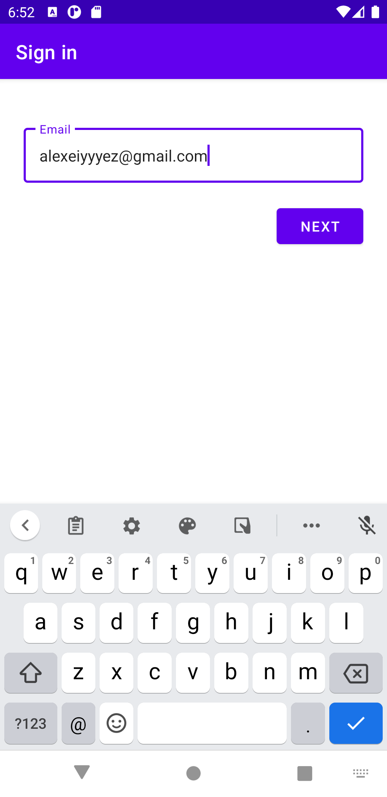
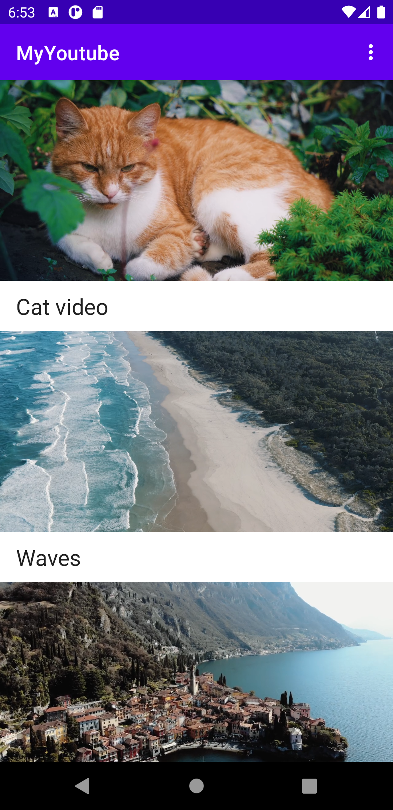
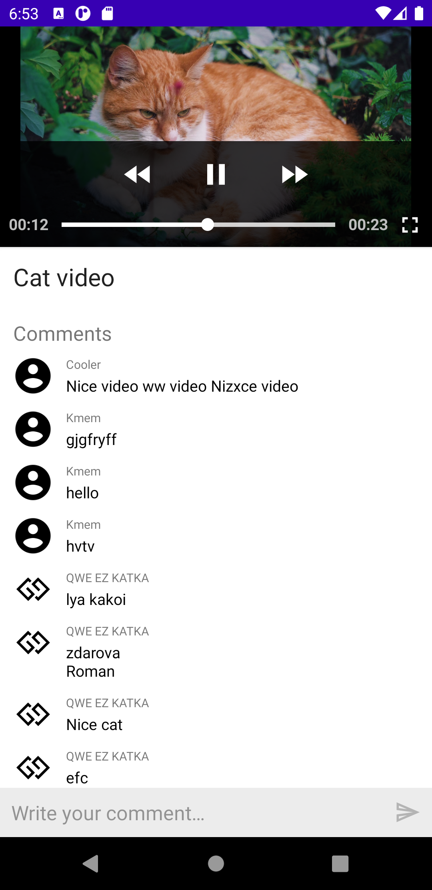

# My youtube
## Description
    Application that retrieves videos from Firebase database.
    Enable you to watch and comment them. Comments are realtime.
    Also Firebase Auth is used.
## Screenshots
       
      
  
  
## Technology Stack
  * Kotlin
  * MVVM
  * Firebase
  * Hilt
  * Jetpack Navigation
  * Data/View Binding
  * Kotlin Flow
  * LiveData
  * Glide
  * ExoPlayer
